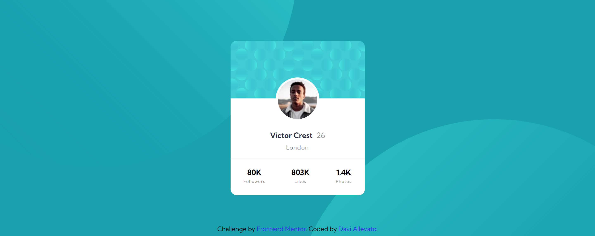

# Frontend Mentor - Profile card component

Esta é uma solução para o [Profile card component](https://www.frontendmentor.io/challenges/profile-card-component-cfArpWshJ/hub/profile-card-component-Uocd-Yzvk). Os desafios do Frontend Mentor ajudam você a melhorar suas habilidades de codificação criando projetos realistas.

## Índice

- [Visão geral](#visão-geral)
  - [O desafio](#O-desafio)
  - [Screenshot](#Screenshot)
  - [Links](#links)
- [Meu processo](#Meu-processo)
  - [Construído com](#Construído-com)
  - [O que aprendi](#O-que-aprendi)
  - [Desenvolvimento contínuo](#Desenvolvimento-contínuo)
  - [Recursos úteis](#Recursos-úteis)
- [Autor](#autor)


## Visão geral

### O desafio

Os usuários devem ser capazes de:

- Visualize o layout ideal dependendo do tamanho da tela do dispositivo
- Veja os estados de foco para elementos interativos

### Screenshot

**Desktop 1440px**



### Links

- URL da solução: []()
- URL do site ao vivo: []()

## Meu processo

### Construído com

- Semantic HTML5 markup
- CSS custom properties
- Flexbox


### O que eu aprendi

Melhorei no uso de tags semânticas facilitando o entendimento de leitores de acessibilidade.

```html
 <footer role="contentinfo">
        Challenge by <a href="https://www.frontendmentor.io/challenges/profile-card-component-cfArpWshJ" target="_blank" aria-label="front end mentor challenges">Frontend Mentor</a>. Coded by <a href="https://github.com/DaviAllevato" target="_blank" aria-label="GitHub">Davi Allevato</a>.
  </footer>
```

Ainda não compreendi o uso do **Position** por completo, mas estou aprendendo.

```css
  .container{
      background-color: var(--Dark_cyan);
      height: 100%;
      padding: 0 10px;
      position: relative;
      overflow: hidden;
      padding: 0 10px;
      display: flex;
      flex-direction: column;
  }

  /* imagens de fundo */

  .bg_top{
      position: absolute;
      top: -100%;
      right: 50%;
      z-index: 9;
  }

  .bg_bottom{
      position: absolute;
      bottom: -122%;
      left: 49%;
      z-index: 9;
  }
```


### Desenvolvimento contínuo

Pretendo continuar refinando e aperfeiçoando técnicas de acessibilidade e utilizando tags semânticas para deixar o site com informações bem explicadas e compreensíveis para o computador e leitores de tela.

### Recursos úteis

- [anoshaahmed/accessibility-info](https://github.com/anoshaahmed/accessibility-info) - Este repositório me ajudou com alguns problemas de acessibilidade.


## Autor

- Frontend Mentor - [@Daviallevato](https://www.frontendmentor.io/profile/DaviAllevato)

- Github - [@Daviallevato](https://github.com/DaviAllevato)

